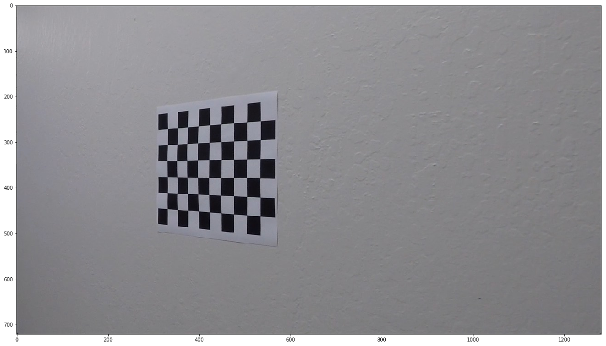
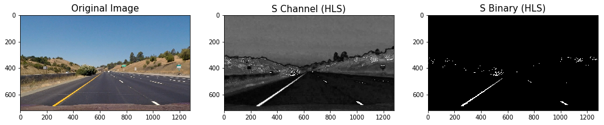
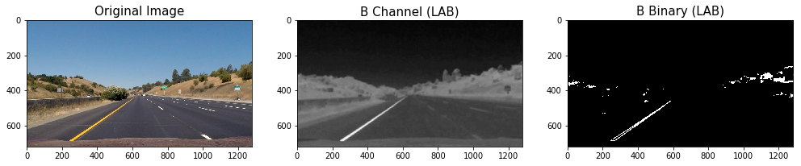
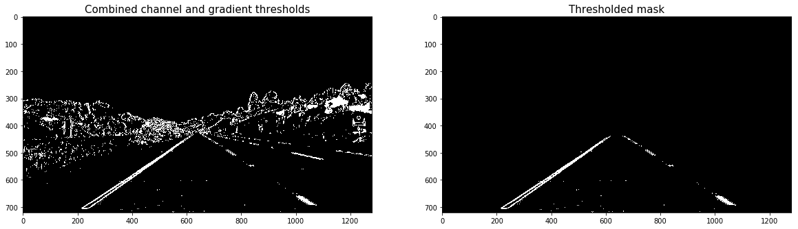
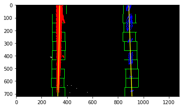
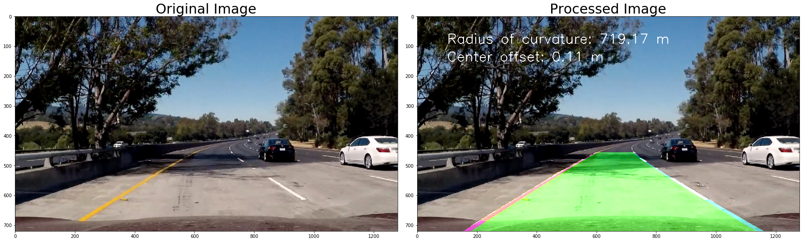
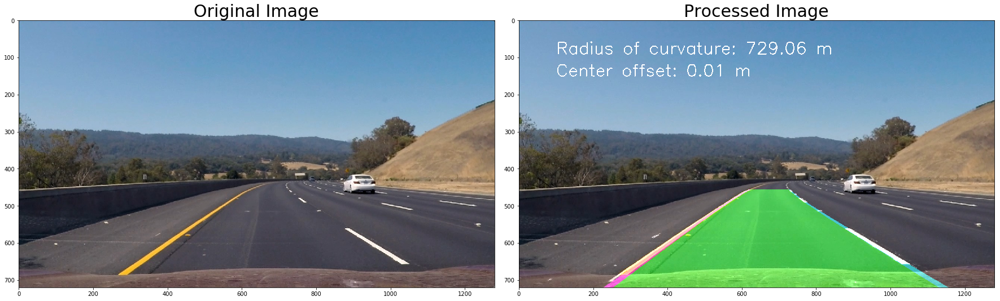

# CarND-AdvancedLaneLine-P2
Udacity Self-Driving Car Engineer Nanodegree Program 

# Overview

In this project, the goal is to write a software pipeline to identify the lane boundaries in a video from a front-facing camera on a car. The camera calibration images, test road images, and project videos are available in the project repository or in the repository folder included with the workspace.

## Steps

The steps of this project are listed below. You can have a look at [Advanced_Lane_Lines.ipynb](Advanced_Lane_Lines.ipynb) for the code.
- Exploration Image
- Calibrating Camera
- Correcting for Distortion
- Color/gradient threshold
	- Applying Sobe
	- Magnitude of the Gradient
	- Direction of the Gradient
	- Combining Thresholds
	- HLS and Color Thresholds
	- Color and Gradient
- Perspective Transform
- Locate the Lane Lines
	- Peaks in a Histogram
	- Sliding Window
- Determine the lane curvature
- Inverse Transform
- Pipeline

The first thing you'll do is to compute the camera calibration matrix and distortion coefficients. You only need to compute these once, and then you'll apply them to undistort each new frame. Next, you'll apply thresholds to create a binary image and then apply a perspective transform.

My code for this project is publicly available and can be found here:  https://github.com/ednaldogoncalves/CarND-AdvancedLaneLines-P2

## Reflection

### Exploration Image

Lets have a look at a sample image, to be used for caliberation. Print out the size of the image. 

### Calibrating Camera

The first step in the project is to remove any distortion from the images by calculating the camera calibration matrix and distortion coefficients using a series of images of a chessboard. 

### Correcting for Distortion

The first step in the project is to remove any distortion from the images by calculating the camera calibration matrix and distortion coefficients using a series of images of a chessboard. 

### Color/gradient threshold

#### Applying Sobe

Identify pixels where the gradient of an image falls within a specified threshold range. 

#### Magnitude of the Gradient

Identify pixels where the gradient of an image falls within a specified threshold range. 

#### Direction of the Gradient

When we play around with the thresholding for the gradient magnitude, we find what you might expect, namely, that it picks up the lane lines well, but with a lot of other stuff detected too. Gradient magnitude is at the heart of Canny edge detection, and is why Canny works well for picking up all edges.

In the case of lane lines, we're interested only in edges of a particular orientation. So now we will explore the direction, or orientation, of the gradient. 

#### Combining Thresholds

Now consider how we can use various aspects of our gradient measurements (x, y, magnitude, direction) to isolate lane-line pixels. Specifically, we can use thresholds of the x and y gradients, the overall gradient magnitude, and the gradient direction to focus on pixels that are likely to be part of the lane lines. 

#### HLS, LUV, LAB Channel and Color Thresholds

Here we'll explore this a bit further to see why a color space like HLS, LUV, LAB can be more robust. Let's first take another look at some of the images.
Here we'll read in the same original image, convert to grayscale, and apply a threshold that identifies the lines. 

 
 
 

#### Color and Gradient

To combine what we know about color and gradient thresholding to get the best of both worlds.

At this point, it's okay to detect edges around trees or cars because these lines can be mostly filtered out by applying a mask to the image and essentially cropping out the area outside of the lane lines. It's most important that we reliably detect different colors of lane lines under varying degrees of daylight and shadow.

We can clearly see which parts of the lane lines were detected by the gradient threshold and which parts were detected by the color threshold by stacking the channels and seeing the individual components. We can create a binary combination of these two images to map out where either the color or gradient thresholds were met. Together, we applied the region of interest mask. 

 

### Perspective Transform

After manually examining a sample image, we extracted the vertices to perform a perspective transform. The polygon with these vertices is drawn on the image for visualization. Destination points are chosen such that straight lanes appear more or less parallel in the transformed image.

The transform and its inverse are computer, for use later. We then transform the binary image. 

### Peaks in Histogram

#### Applying Sobe

After applying calibration, thresholding, and a perspective transform to a road image, we should have a binary image where the lane lines stand out clearly. However, we still need to decide explicitly which pixels are part of the lines and which belong to the left line and which belong to the right line.

Plotting a histogram of where the binary activations occur across the image is one potential solution for this. 

#### Sliding Window

I then perform a sliding window search, starting with the base likely positions of the 2 lanes, calculated from the histogram. I have used 10 windows of width 100 pixels.

The x & y coordinates of non zeros pixels are found, a polynomial is fit for these coordinates and the lane lines are drawn.

We can use the two highest peaks from our histogram as a starting point for determining where the lane lines are, and then use sliding windows moving upward in the image (further along the road) to determine where the lane lines go. 

#### Search from Prior

Using the full algorithm from before and starting fresh on every frame may seem inefficient, as the lines don't necessarily move a lot from frame to frame.
We need to do a blind search again, but instead you can just search in a margin around the previous line position, like in the above image. The green shaded area shows where we searched for the lines this time. So, once we know where the lines are in one frame of video, we can do a highly targeted search for them in the next frame.
This is equivalent to using a customized region of interest for each frame of video, and should help us track the lanes through sharp curves and tricky conditions. 

### Determine the lane curvature

We have a thresholded image, where we've estimated which pixels belong to the left and right lane lines (shown in red and blue, respectively, above), and you've fit a polynomial to those pixel positions. Next we'll compute the radius of curvature of the fit. 

### Inverse Transform

In this block of code we:

- Paint the lane area
- Perform an inverse perspective transform
- Combine the precessed image with the original image. 

## Results:

### Pictures
Here some results on test images provided by Udacity: 

straight_lines1.jpg 

straight_lines2.jpg 

test1.jpg 

test2.jpg 

test3.jpg 

test4.jpg 

test5.jpg 

test6.jpg 

You can find the original pictures and the results in the folder ‘output_images’.

### Videos
Here some results on test videos provided by Udacity: You can find the video files on: 

Result Project  
 
<a href="./output_videos/result_project_video.mp4">Download video</a>

Result Challenge 
 
<a href="./output_videos/result_challenge_video.mp4">Download video</a>

Harder Challenge 
 
<a href="./output_videos/result_harder_challenge_video.mp4">Download video</a>

## Discussion

In the video of the main Project, I did not have significant problems in detecting the lines of the road, because the video shows a road in basically ideal conditions, with very different lane lines and on a clear day, but I had problems of detection of the line on top of the bridge where the highway becomes lighter and soon there is a small shade of a tree.

In the first second of the Challenge video, the image processing function is confused with the imperfection of the road. Also, when it arrives in the second 3, because of the surplus caused by the viaduct, the image processing was not successful. Further on it continues to be lost because of the imperfection of the road. I did everything, but I could not solve this problem.

In the Harder Challenge video, the situation worsened, as the image processing function was completely lost in the curves and a white spot appears on the right and left side of the roadway mask. I also broke my mind to solve this problem, but unfortunately, I could not.

For me, this project was very challenging, but what I learned from it was that it's relatively easy to tune the software pipeline to work well under consistent road and weather conditions, but it's hard to find a single combination that produces the same result in any condition without adjusting the parameters. I have in mind, for further research, I plan to record some additional video streams that I drive myself under various conditions and continue refining my pipeline to work in more varied environments.